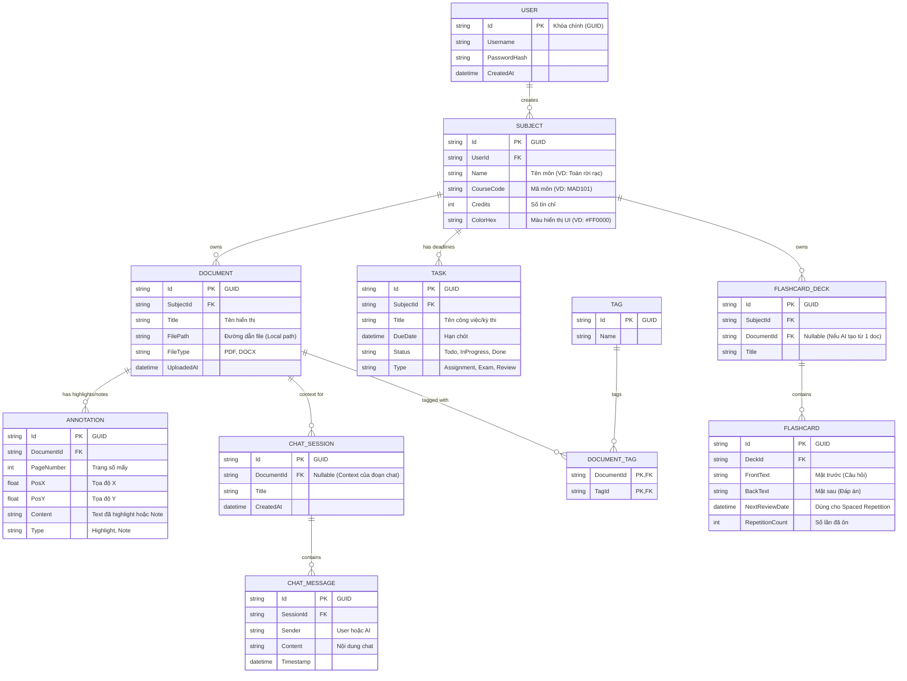

# Sơ đồ Thực thể Liên kết (ERD) - AI Study Hub

Để đảm bảo hệ thống không bị "phá vỡ" (breaking changes) khi mở rộng trong tương lai (đặc biệt là khi nâng cấp các tính năng AI, Flashcard và Spaced Repetition), cơ sở dữ liệu cần được thiết kế với tính chuẩn hóa cao và hỗ trợ các trường linh hoạt.

Dưới đây là sơ đồ ERD được thiết kế cực kỳ chi tiết, đáp ứng cả MVP hiện tại và Vision tương lai.

## 1. Sơ đồ ERD (Mermaid Code)

Bạn có thể xem trực tiếp sơ đồ này bằng cách dùng tính năng **Markdown Preview** của Visual Studio Code (phím tắt `Ctrl + Shift + V`).

## 2. Giải thích thiết kế (Design Rationale) để chống "Gãy" trong tương lai

1. **Khóa chính là chuỗi GUID (uniqueidentifier):** 
   - Tất cả khóa chính đều dùng kiểu `string` (chứa GUID) thay vì số nguyên `int` tự tăng (Auto Increment). 
   - **Lý do:** Lợi ích lớn nhất là nếu sau này bạn làm thêm app Mobile và muốn đồng bộ data (Sync) giữa PC, Mobile và Cloud, GUID sẽ không bao giờ bị trùng lặp khóa chính ở các thiết bị khác nhau.
2. **Bảng `USER`:** 
   - Dù ứng dụng hiện tại là Desktop App (lưu Local bằng SQLite), nhưng thiết kế sẵn bảng User giúp bạn dễ dàng nâng cấp lên tính năng hỗ trợ nhiều profile trên cùng 1 máy tính hoặc **Cloud Sync** (Đồng bộ đám mây) sau này.
3. **Bảng `ANNOTATION` (Cực kỳ quan trọng cho PDF Viewer):** 
   - Lưu trữ chi tiết `PageNumber`, `PosX`, `PosY`. 
   - **Lý do:** Việc này cho phép app vẽ lại (render) chính xác vị trí người dùng đã highlight hoặc gắn sticky note mỗi lần mở file, mà không làm hỏng cấu trúc file PDF gốc (Non-destructive editing).
4. **Thuật toán Spaced Repetition cho `FLASHCARD`:** 
   - Thay vì chỉ lưu Câu hỏi - Trả lời, bảng Flashcard có trường `NextReviewDate` (Ngày ôn tập tiếp theo) và `RepetitionCount`. 
   - **Lý do:** Điều này dọn đường sẵn cho tính năng "Lặp lại ngắt quãng" (tương tự thuật toán của app Anki) - một tính năng must-have cho app hỗ trợ học tập, giúp AI tự tính toán và nhắc sinh viên ôn bài đúng thời điểm sắp quên.
5. **Bảng `CHAT_SESSION` & `CHAT_MESSAGE`:** 
   - Thiết kế chuẩn theo cấu trúc API của OpenAI (ChatGPT). Chia theo Session (phiên chat) giúp người dùng lưu lại lịch sử hội thoại thay vì hỏi xong là mất. 
   - `DocumentId` (Nullable) cho phép AI biết phiên chat này có đang bám sát vào nội dung của một file PDF cụ thể nào không (Đây chính là kiến trúc RAG - Retrieval-Augmented Generation).
