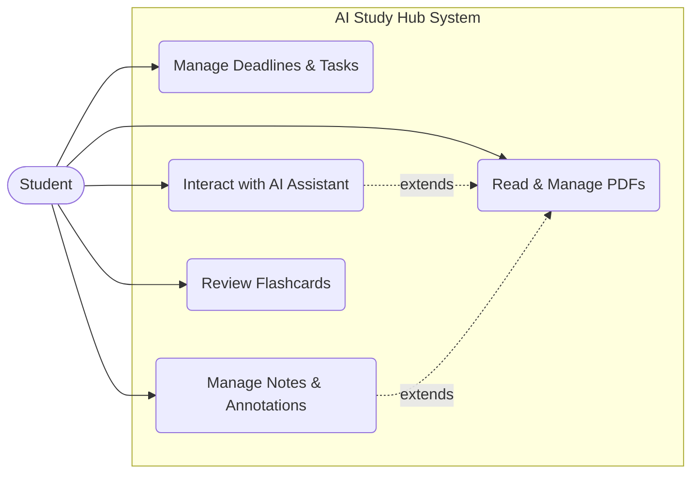
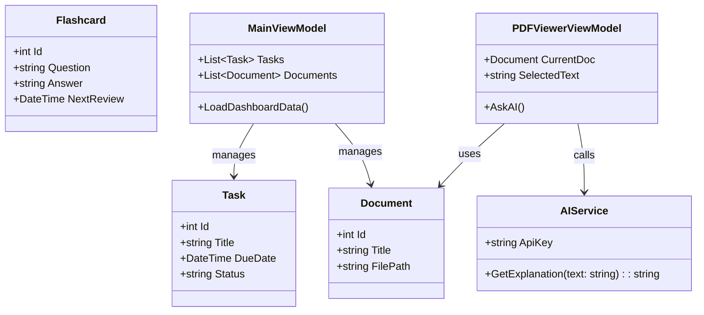
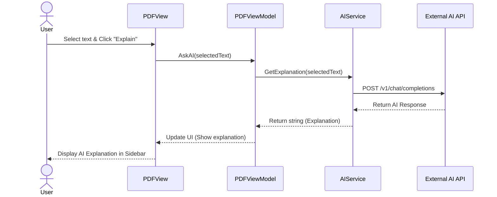
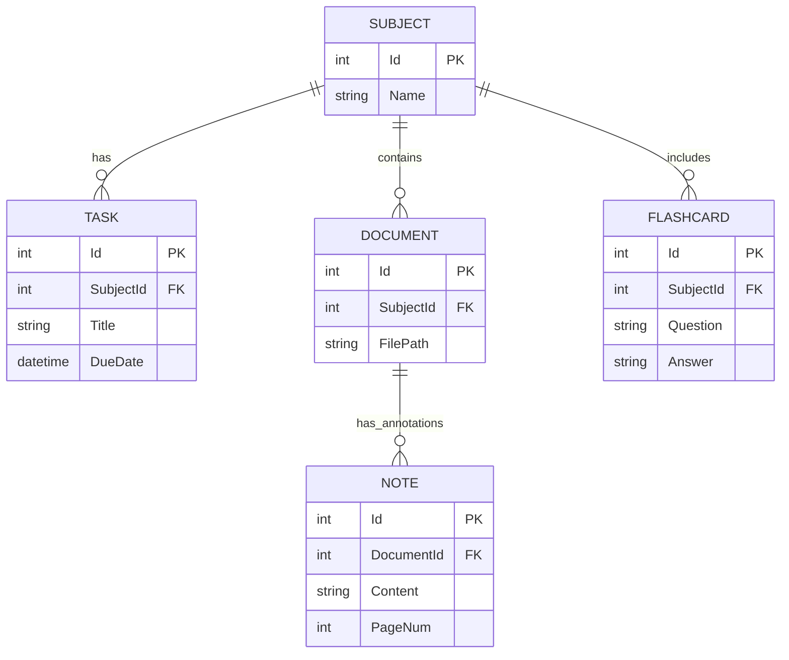

# **Report 2: System Analysis and Design**

## **1. System Overview**
- **Purpose and Functionality:** AI Study Hub là một ứng dụng desktop toàn diện được thiết kế để tối ưu hóa quá trình học tập. Ứng dụng tích hợp nhiều công cụ vào một nền tảng duy nhất, bao gồm: theo dõi deadline, xem và ghi chú tài liệu PDF, ôn tập bằng Flashcard (spaced repetition). Đặc biệt, ứng dụng tích hợp trợ lý AI (OpenAI/Gemini API) trực tiếp vào luồng học tập, cho phép người dùng hỏi đáp, tóm tắt và giải thích nội dung ngay trên tài liệu đang đọc.
- **Intended Users:** Học sinh, sinh viên, người đi làm và những người có nhu cầu tự học cần một công cụ quản lý tài liệu và thời gian thông minh.
- **Target Platform:** Ứng dụng Windows Desktop (phát triển bằng C# WPF, kiến trúc MVVM, cơ sở dữ liệu cục bộ SQLite).

## **2. UML Diagrams**
*(Mô tả và mã vẽ cho các biểu đồ. Để vẽ các biểu đồ này trên **Draw.io**, bạn hãy sao chép mã dưới đây, mở Draw.io, chọn menu **Arrange -> Insert -> Advanced -> Mermaid**, dán mã vào và nhấn Insert. Không sử dụng PlantUML theo như yêu cầu.)*

### **2.1. Use Case Diagram**
- **Mô tả:** Biểu đồ thể hiện các tương tác chính của người dùng (Student) với hệ thống AI Study Hub, bao gồm Quản lý Task, Đọc & Ghi chú PDF, Tương tác với AI, và Ôn tập Flashcard.

**Mã Draw.io (Mermaid format):**

### **2.2. Class Diagram**
- **Mô tả:** Biểu đồ lớp tổng quan theo kiến trúc MVVM. Gồm các Models (Task, Document, Flashcard), ViewModels xử lý logic, và Views đại diện cho giao diện người dùng. Có sự xuất hiện của `AIService` để xử lý API call.

**Mã Draw.io (Mermaid format):**

### **2.3. Sequence Diagram**
- **Mô tả:** Luồng sự kiện khi người dùng bôi đen một đoạn văn bản trong PDF và yêu cầu AI giải thích.

**Mã Draw.io (Mermaid format):**

## **3. Database Design**

### **3.1. Entity-Relationship Diagram (ERD)**
- **Mô tả:** Cấu trúc cơ sở dữ liệu SQLite gồm các bảng chính: Subject, Task, Document, Note, và Flashcard.

**Mã Draw.io (Mermaid format):**

### **3.2. Database Schema and Table Descriptions**
- **Subjects:** Lưu trữ thông tin môn học/chủ đề học tập.
- **Tasks:** Lưu trữ các hạn chót (deadlines), lịch thi và trạng thái hoàn thành. Có liên kết `SubjectId`.
- **Documents:** Lưu đường dẫn (file path) và metadata của các file PDF được người dùng import vào ứng dụng.
- **Notes:** Lưu trữ các ghi chú hoặc highlights người dùng tạo khi đọc file PDF, gắn liền với `DocumentId` và số trang.
- **Flashcards:** Lưu trữ câu hỏi, câu trả lời và thuật toán lặp lại ngắt quãng (Spaced Repetition) thông qua trường `NextReviewDate`.

## **4. User Interface (UI) Mockups**
- **Lưu ý thực hành:** Team hãy xuất các frame thiết kế từ Figma thành file ảnh (.png/.jpg) và chèn vào đây (sử dụng cú pháp ``).
- **Design Rationale & User Flow:** 
  - Giao diện được xây dựng bằng `MaterialDesignInXaml` nhằm đảm bảo tính hiện đại, đồng bộ và trực quan.
  - **Luồng người dùng (User Flow):** Khởi động ứng dụng $\rightarrow$ Dashboard (Xem tổng quan task sắp đến hạn) $\rightarrow$ Chọn một Document $\rightarrow$ Mở PDF Viewer $\rightarrow$ Đọc & bôi đen chữ $\rightarrow$ Sidebar bên phải hiển thị AI chat để giải thích.
  - Sử dụng giao diện Dark Mode / Light Mode để bảo vệ mắt cho sinh viên khi học đêm.

## **5. CI/CD Planning**
- **CI/CD Tools & Pipelines:**
  - Sử dụng **GitHub Actions** làm công cụ CI/CD chính do sự tích hợp chặt chẽ với GitHub repository.
  - **Pipeline Outline:** Mỗi khi có Pull Request hoặc Commit push lên nhánh `main`, một luồng workflow sẽ được kích hoạt để chạy lệnh `dotnet build` và `dotnet test` nhằm đảm bảo không có lỗi biên dịch.
- **Integration Approach:**
  - Version Control: Sử dụng Git flow cơ bản (các nhánh tính năng `feature/...` được gộp vào `main`).
  - Deployment Process: Nếu build thành công trên GitHub Actions, tự động đóng gói ứng dụng (publish ra file `.exe` hoặc `.zip` portable) và tải lên mục **Releases** của GitHub để các thành viên QA (kiểm thử viên) dễ dàng tải về.

## **6. Team Contributions**
*(Dựa theo phân công của Report 1)*
- **Phong (PM & Database):** Thiết kế Database Schema, ERD, lập kế hoạch dự án và kiến trúc tổng quan.
- **Vương (UI/UX Lead):** Thiết kế Mockups UI (Figma), định hướng Design Rationale và chuẩn bị quy tắc giao diện XAML.
- **Hòa:** Phân tích System Overview, thiết kế UML cho Module Task/Deadline.
- **Minh:** Thiết kế cấu trúc lưu trữ và UML cho Module PDF Viewer.
- **Tân:** Thiết kế Sequence Diagram cho luồng gọi AI API, lập kế hoạch tích hợp trợ lý ảo.
- **Duy:** Lên kế hoạch mô hình CI/CD cơ bản và thiết kế logic cho Module Note/Flashcard.
