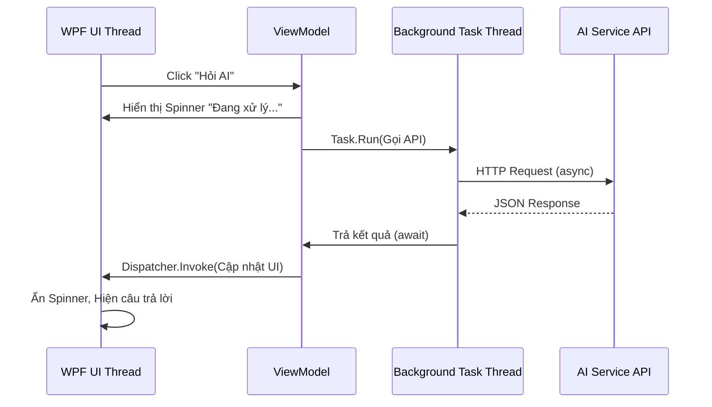

# **Report 3: Core Feature Development Report (Development Phase)** 

## **1. Development Progress Overview** 
- **Current Progress:** Dự án đang nằm trong giai đoạn Phát triển Cốt lõi (Development Phase). Đội ngũ đã hoàn thành việc thiết lập khung kiến trúc phần mềm, cấu hình cơ sở dữ liệu và hoàn thiện giao diện khung.
- **Completed vs. Planned:**
  - **Đã hoàn thành:** Thiết lập xong kiến trúc MVVM, cấu hình Entity Framework Core với SQLite; Xây dựng xong UI chính, Module Quản lý Deadline/Task (CRUD), Module đọc file PDF cơ bản, và bộ khung gọi API AI.
  - **Đang tiến hành/Chưa hoàn thành:** Module ghi chú (Annotation) trực tiếp lên PDF còn lỗi tọa độ khi zoom; Module thuật toán Spaced Repetition cho Flashcard đang được phát triển; Đang tích hợp UI của AI Chatbot đồng bộ với thao tác chọn văn bản trên PDF.

## **2. Implemented Features** 
- **Task Management (Quản lý tiến độ):** Cho phép người dùng thêm, sửa, xóa, và đánh dấu hoàn thành các deadline/môn học. Hỗ trợ hiển thị danh sách công việc theo ngày.
- **PDF Viewer Module (Đọc tài liệu):** Cho phép import và hiển thị file PDF nội bộ với chức năng chuyển trang và zoom.
- **AI Assistant Integration (Trợ lý AI):** Thanh sidebar chat AI. Người dùng có thể bôi đen chữ trên PDF và ấn nút để gửi câu hỏi sang AI (Gemini/OpenAI) giải thích hoặc dịch thuật.
- **Local Database (Lưu trữ):** Dữ liệu được lưu trữ an toàn dưới dạng file SQLite cục bộ (`.db`), đảm bảo tính riêng tư cho học sinh.
*(Lưu ý cho Team: Chèn hình ảnh Screenshot thực tế của các tính năng này từ phần mềm của bạn bằng cú pháp ``)*

## **3. Technical Implementation** 
*(Để minh họa luồng gọi bất đồng bộ, tôi đính kèm một sơ đồ luồng. Mã Mermaid dưới đây tương thích với **Draw.io**. Bạn hãy mở Draw.io $\rightarrow$ Arrange $\rightarrow$ Insert $\rightarrow$ Advanced $\rightarrow$ Mermaid $\rightarrow$ Dán đoạn mã này vào)*

- **OOP Principles:** 
  - *Tính Đóng gói (Encapsulation):* Các thuộc tính của Model được đóng gói thông qua hệ thống Binding của WPF. ViewModel sử dụng `INotifyPropertyChanged` để cập nhật View mà không để lộ logic bên trong.
  - *Tính Đa hình (Polymorphism) & Trừu tượng (Abstraction):* Xây dựng các Interface như `IAIService`, `IDatabaseService`. Giúp dễ dàng thay thế từ OpenAI sang Gemini mà không phải sửa code tầng ViewModel.
- **EF Core:** Sử dụng mô hình **Code-First**. Các lớp C# (`Task`, `Document`, `Flashcard`) được tự động ánh xạ (map) thành các bảng trong SQLite. Sử dụng LINQ để truy xuất dữ liệu an toàn.
- **WPF for UI:** Sử dụng chặt chẽ mô hình **MVVM** (Model - View - ViewModel). View (file `.xaml`) hoàn toàn không chứa logic nghiệp vụ ở code-behind (`.xaml.cs`) mà giao tiếp với ViewModel qua `Binding` và `ICommand`. Dùng thư viện `MaterialDesignInXaml` để chuẩn hóa giao diện.
- **Multithreading techniques:** Triển khai **Async/Await** trong C#. Mọi tương tác có độ trễ (truy vấn Database EF Core, đọc file PDF nặng, gọi HTTP Request AI API) đều được bọc trong các `Task` chạy nền để giải phóng **Main UI Thread**, đảm bảo ứng dụng không bị "đơ" (Not Responding).

## **4. Challenges and Solutions** 
- **Thử thách 1: Giao diện bị treo khi gọi AI API.** 
  - *Vấn đề:* Khi gọi API mất 3-5 giây, Main Thread của WPF bị khóa chờ phản hồi, làm ứng dụng bị đơ.
  - *Giải pháp:* Chuyển đổi phương thức gọi API sang `async/await` và sử dụng `Task.Run()`. Khi nhận được kết quả, dùng `Application.Current.Dispatcher.Invoke` để đẩy dữ liệu ngược lại luồng UI một cách an toàn.
- **Thử thách 2: Hiển thị PDF trong WPF.**
  - *Vấn đề:* WPF không hỗ trợ tốt việc render file PDF nguyên bản.
  - *Giải pháp:* Sử dụng thư viện bên thứ 3 là `PdfiumViewer` kết hợp với `WindowsFormsHost` để nhúng control của Windows Forms vào trong ứng dụng WPF. Cần kiểm soát kỹ sự kiện đóng file để giải phóng bộ nhớ (Dispose).

## **5. Git Commit History** 
- Đội ngũ áp dụng mô hình Git Flow cơ bản. Nhánh `main` dùng để chứa code chạy được (production-ready). Các thành viên tạo nhánh `feature/<tên_tính_năng>` để phát triển độc lập, sau đó tạo Pull Request.
- *(Lưu ý: Bạn hãy dán Link đến nhánh GitHub của nhóm và chụp màn hình log các lệnh commit. Ví dụ một số commit chuẩn:)*
   - `[Phong] feat: Implement EF Core SQLite DbContext`
   - `[Vuong] feat: Add MVVM framework and BaseViewModel`
   - `[Tan] feat: Async API integration for Gemini Assistant`

## **6. Code Quality and Documentation** 
- **Code Quality:** 
  - Tuân thủ chặt chẽ **C# Naming Conventions**: Tên Lớp, Thuộc tính, Phương thức dùng `PascalCase`; tên biến cục bộ, tham số dùng `camelCase`; biến private field dùng `_camelCase`.
  - Tổ chức code rõ ràng theo thư mục: `/Models`, `/ViewModels`, `/Views`, `/Services`.
- **Documentation:** 
  - Thêm XML Comments (`/// 
`) ở phía trên các hàm phức tạp, Interface và các lớp Service quan trọng.
  - Các khối logic dài được comment in-line để giải thích "tại sao" thuật toán được viết theo cách đó.

## **7. Testing Activities** 
- **Testing Activities:**
  - Chủ yếu tiến hành **Manual Testing** (Kiểm thử thủ công) ở cấp độ Module. Từng developer tự test tính năng (VD: thêm thử 100 task để xem list có bị giật lag không, test trường hợp không kết nối mạng khi gọi AI).
- **Known Issues (Lỗi đang tồn tại):** 
  - Tọa độ nét vẽ Note trên file PDF bị sai lệch khi người dùng thay đổi tỷ lệ Zoom.
  - Ứng dụng đôi khi crash nếu nhập API Key không hợp lệ.
- **Plans for resolution:**
  - Tính toán lại ma trận tọa độ (Matrix Transform) giữa khung hiển thị và tài liệu gốc khi Zoom PDF. Thêm khối try-catch bao bọc kỹ logic HTTP Request của AI để báo lỗi thay vì crash app.

## **8. Next Steps** 
- Hoàn thiện xử lý lỗi tọa độ Annotation và tích hợp thuật toán Spaced Repetition cho Flashcard.
- Tiến vào giai đoạn **Integration Phase**:
  - Merge tất cả nhánh feature còn lại vào `main`.
  - Giải quyết các xung đột code (Merge Conflicts).
  - Bắt đầu Testing toàn hệ thống (System Testing) kết hợp (Bug Bash) để chuẩn bị đóng gói sản phẩm bản `.exe` đầu tiên.
